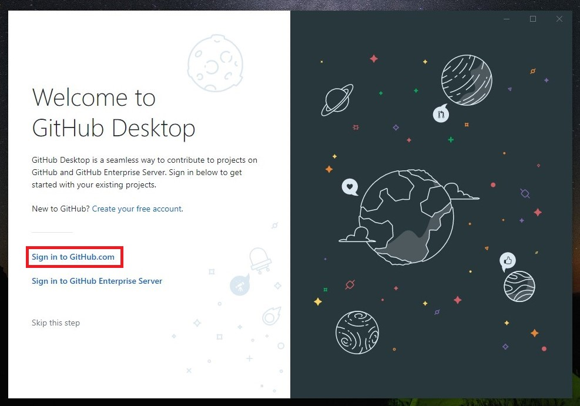
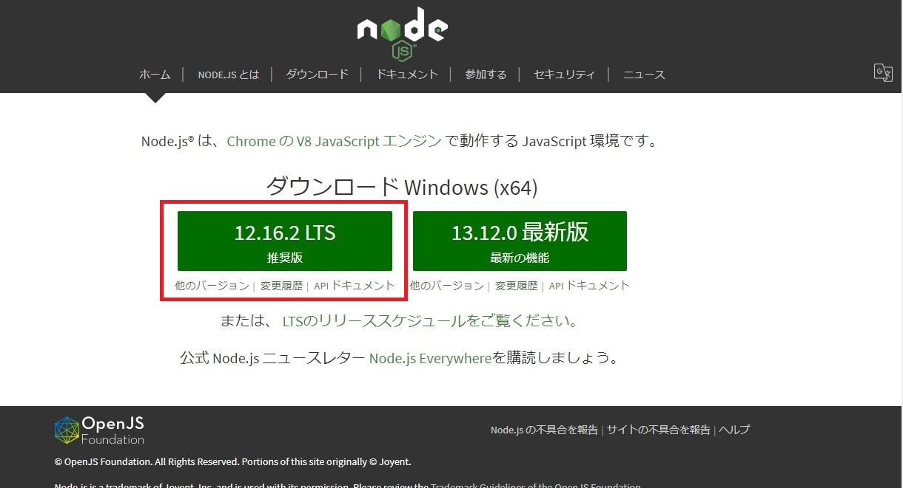
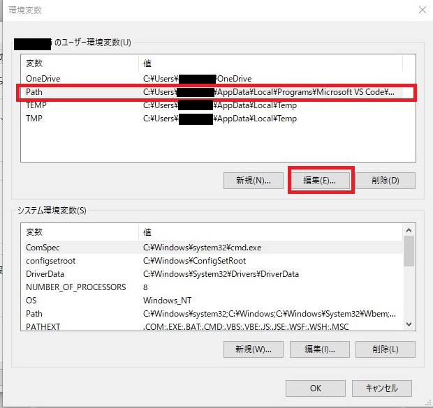
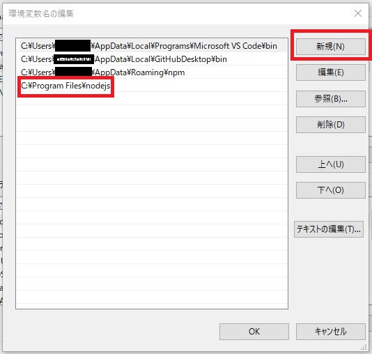

# ツールとセットアップ

1. [GitHub Desktop](#1-github-desktop)
2. [Visual Studio Code](#2-visual-studio-code)
3. [Google Chrome](#3-google-chrome)
4. [Node.Js](#4-node.js)

## 1. GitHub Desktop

1. [GitHub Desktop](https://desktop.github.com/)のサイトをアクセスしてダウンロードする。
2. インストールする。
3. 開いた画面で、「`Sign in to GitHub.com`」をクリックする。

4. ユーザー名とパスワードを入力して、「`Sign in`」ボタンをクリック。
5. 次の画面では何も変更せずに、「`Continue`」ボタンをクリック。
6. チェックマークを外して、「`Finish`」

## 2. Visual Studio Code

1. [Visual Studio Code](https://code.visualstudio.com/download)のサイトへアクセスしてダウンロードする。
2. インストールする。

## 3. Google Chrome

1. [Google Chrome](https://www.google.com/intl/ja_jp/chrome/)をダウンロードしてインストールする。

## 4. Node.Js

1. [Node.js](https://nodejs.org/ja/)へアクセスして、推奨版をダウンロード・インストールする。

2. インストール手順はすべて「次へ」を選択する。　
3. ユーザーの環境変数のPathにnodejsフォルダのパスを追加する。デフォルトで「C:\Program Files\nodejs」にインストールされます。(Windows-64bitの場合)

